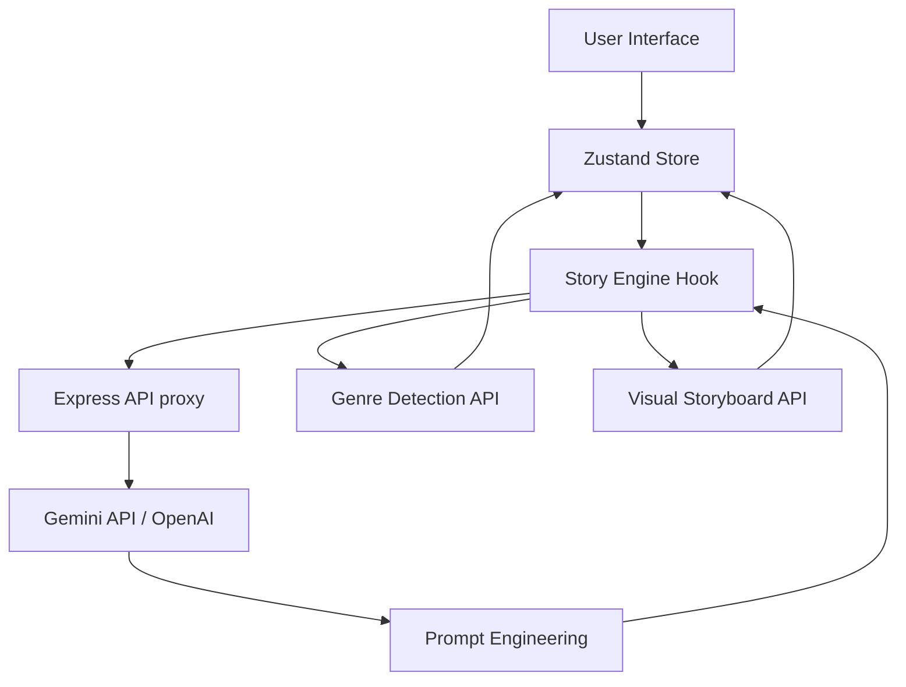

# Story Swarm 🎬🤖

**Story Swarm** is a chaotic, multi-agent cinematic storytelling simulator. It brings together multiple distinct AI personalities that collaboratively weave a movie narrative in real-time, governed by an orchestrator and influenced by a dynamic "Chaos Level" and "Global Temperature".

https://github.com/user-attachments/assets/6ecb097c-48ca-45ae-8903-b47eff6ad8ab

## Features

- **Multi-Agent Collaboration**: Up to 6 unique agents (The Neo-Noir Cynic, The Surrealist Dreamer, etc.) can occupy the writer's room.
- **Dynamic Genre Detection**: The system analyzes the narrative trajectory in real-time and shifts the UI's atmospheric glow to match (e.g., Crimson for Noir, Cyan for Cyberpunk).
- **Cinematic Visual Storyboard**: Every few rounds, a dedicated visual engine generates storyboard frames capturing the narrative's essence.
- **Neural Calibration**: Fine-tune each agent's individual temperature, provider, and model for hyper-specific outputs.
- **The Director's Observation**: Random meta-commentary injected by a "Director" AI to critique or steer the vibe.
- **Final Synthesis**: Generates a professional movie poster title, tagline, and synopsis once the script concludes.

## Technology Stack

- **Frontend**: React 18, Vite, Tailwind CSS (v4)
- **State Management**: Zustand
- **Animations**: Motion (framer-motion)
- **Icons**: Lucide React
- **Backend**: Node.js, Express
- **AI Engine**: Google Gemini (via `@google/genai`), supporting multi-provider fallback.
- **Visuals**: Pollinations.ai (Storyboard frames)

## 🏗️ Architecture



### Key Components

- **`useStoryEngine.ts`**: The brain of the app. It handles the loop of agent responses, context management, and secondary AI tasks like genre detection.
- **`store/index.ts`**: Holds the state for history, active agents, and UI parameters.
- **`server.ts`**: A secure proxy to keep API keys server-side while handling complex AI formatting (JSON schema responses).

## Getting Started

1. **Clone & Install**:
   ```bash
   git clone https://github.com/harishkotra/story-swarm.git
   cd story-swarm
   npm install
   ```

2. **Environment Setup**:
   Create a `.env` file based on `.env.example`:
   ```env
   GEMINI_API_KEY=your_key_here
   ```

3. **Develop**:
   ```bash
   npm run dev
   ```

## Contributing

We welcome contributions! Here are some ideas for new features:
- **Audio Synthesis**: Using ElevenLabs or similar to give each agent a unique voice.
- **Live Branching**: Letting the user "intervene" and force a plot point.
- **Agent Duels**: A mode where agents compete for the most dramatic twist.
- **Export to Video**: Combining the storyboard and text into a short cinematic teaser.
